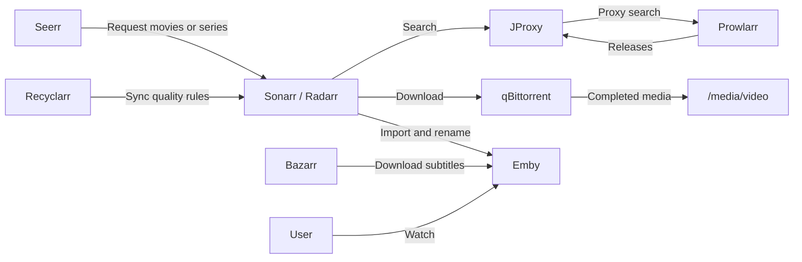

# Automatic Theater

Automatic Theater is a preconfigured Docker Compose media stack for fast deployment and migration. The repository keeps the services, default application state, and install script together so a new host can be started with minimal manual setup.

## Included services

| Service | Purpose | URL |
| --- | --- | --- |
| Heimdall | Dashboard and launch page | `https://ip:60211` |
| FlareSolverr | Cloudflare challenge solver for Prowlarr | `http://ip:60213` |
| Prowlarr | Indexer manager | `http://ip:60223` |
| JProxy | Search proxy/filter between Sonarr/Radarr and Prowlarr | `http://ip:60215` |
| Seerr | Request portal for movies and series | `http://ip:60216` |
| Radarr | Movie automation | `http://ip:60217` |
| Sonarr | Series and anime automation | `http://ip:60218` |
| Bazarr | Subtitle automation | `http://ip:60222` |
| Recyclarr | Sonarr/Radarr quality-rule sync | configuration only |
| qBittorrent | Download client | `http://ip:60219` |
| ChineseSubFinder | Subtitle finder | `http://ip:60221` |
| Emby | Media server | `http://ip:60220` |

Default login for preconfigured services that require credentials:

| Username | Password |
| --- | --- |
| `atm` | `atm@20230101` |

## Runtime flow



## Defaults

- Timezone: `Asia/Singapore`
- Docker subnet: `172.30.12.0/24`
- Media root: `/media/video`
- Media folders: `/media/video/movie`, `/media/video/serial`, `/media/video/anime`, `/media/video/download`
- Config root: `./config`
- Image tags: `latest`
- Default language: English

If `172.30.12.0/24` conflicts with the target host network, edit `docker-compose-default.yml` before running the installer.

## Prerequisites

Install Git, Docker, and Docker Compose v2 on the target host.

Ubuntu/Debian example:

```bash
sudo apt update
sudo apt install -y sudo git curl
curl -fsSL https://get.docker.com | sudo sh
sudo docker compose version
```

If the current user is not in the Docker group, run Docker commands with `sudo`.

## Install

Clone or copy the repository to the target host:

```bash
git clone https://github.com/skyrealmus/automatic-theater.git
cd automatic-theater
```

Review and edit `docker-compose-default.env` if needed:

```bash
vi docker-compose-default.env
```

Run the installer:

```bash
chmod +x install.sh
./install.sh
```

The installer creates media directories, writes `.env` and `docker-compose.yml`, and adds detected hardware-acceleration devices.

Start the stack:

```bash
sudo docker compose pull
sudo docker compose up -d
```

Stop the stack:

```bash
sudo docker compose down
```

## Migration

To migrate, copy the repository directory and the media root to the new host, review `docker-compose-default.env`, run `./install.sh`, then start with Docker Compose.

## Security note

This repository intentionally ships preconfigured application state for out-of-the-box deployment. Before exposing any service outside a trusted network, change passwords and API keys and update dependent service settings.

## Contributing

Issues and pull requests are welcome at <https://github.com/skyrealmus/automatic-theater>.

## License

MIT. Maintained at <https://github.com/skyrealmus/automatic-theater>. Original project by LuckyPuppy514.
